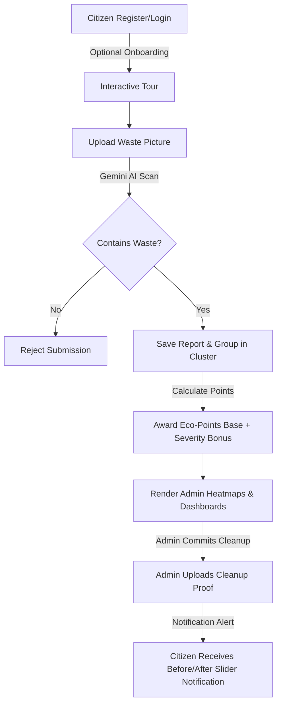

# TrashGo - Smart Waste Management System

TrashGo is a full-stack civic-tech platform that connects citizens with government authorities for efficient waste management. It empowers users to report waste accumulation in their localities and allows administrators to manage and track the cleanup process effectively.

---

## 🚀 Features

### 👤 Citizen Portal
- **User Authentication:** Secure signup and login supporting both `HttpOnly` cookie sessions and JWT-based authorization headers.
- **AI-Powered Waste Scanning:** Integrates with the **Google Gemini API** to automatically analyze waste uploads:
  - **Smart Validation:** Instantly rejects non-garbage images to prevent spam reporting.
  - **Auto-Categorization:** Classifies waste into types (Plastic, Metal, Electronic, Paper, Biohazard, or General).
  - **Severity Scoring:** Automatically rates severity (Low, Medium, High).
- **Proximity-Based Priority Scoring:** Clusters nearby reports within an ~111m radius and scales the report's priority score combined with the AI-determined severity weight (+1 for Low, +3 for Medium, +5 for High).
- **Gamification & Dynamic Eco-Points:** Citizens earn a base of 10 Eco-Points for reporting, plus bonus points based on report severity (+5 for Medium, +10 for High), and another 50 points upon successful cleanup. A real-time leaderboard ranks the Top 3 Eco-Warriors.
- **Interactive Onboarding Tour:** Embedded walk-through guided tour using `driver.js` to introduce the portal's UI components to new users.
- **Completed Cleanup Alerts:** Real-time citizen alerts when reports are marked as completed. Alerts feature a custom interactive before/after comparison time-lapse slider showing the site restoration.

### 🛡️ Admin Dashboard
- **Location-based Grouping:** Automatically groups reports by geographical coordinates using OpenStreetMap reverse-geocoding, allowing admins to manage entire waste clusters collectively.
- **Interactive Heatmap:** Integrates Leaflet.js to render hotspot visualizations representing high-priority trash accumulation zones.
- **Eco-Warriors Network Directory:** A dedicated table monitoring registered users, displaying their rankings, emails, accumulated Eco-Points, and signup details.
- **Rewards Redemption Manager:** A persistent logs manager where admins can view reward claim codes, search/filter user requests, and mark redemptions as Approved/Disbursed.
- **Verification Sliders:** Admins can upload a post-cleanup verification image and resolve reports using visual comparison sliders.

### 🔒 Enterprise-Grade Security & Hardening
- **HTTP Security Headers (`Helmet`):** Enforces strict HTTP security headers (CSP, X-Frame-Options, X-Content-Type-Options) with tailored content policies for Leaflet map tiles, OpenStreetMap reverse geocoding, and Cloudinary media assets.
- **Rate Limiting & Anti-Brute-Force:** Throttles general API requests (200 requests/15 mins) and enforces strict protection on login and registration endpoints (15 attempts/15 mins) via `express-rate-limit`.
- **HttpOnly & SameSite Cookie Auth:** Transmits authentication tokens in `HttpOnly` cookies to mitigate Cross-Site Scripting (XSS) session hijacking risks.
- **Configured CORS Policy:** Restricts backend API access to allowed origins with credentialed request verification.
- **Production Error Masking & Clean Logging:** Strips raw internal database error traces from API responses and eliminates sensitive credential logging from server stdout.
- **Hardened Admin Credentials Setup:** Enforces mandatory `ADMIN_PASSWORD` environment variables for initialization scripts, eliminating hardcoded weak defaults.

---

## 🛠️ Tech Stack

- **Frontend:** HTML5, CSS3, Vanilla JavaScript, Leaflet.js (Heatmaps), `driver.js` (Onboarding Tour)
- **Backend:** Node.js, Express.js (v5+)
- **Security Middleware:** `Helmet`, `express-rate-limit`, `cookie-parser`, `cors`, `bcryptjs`
- **AI Engine:** Google Gemini AI API (`@google/generative-ai` SDK)
- **Database:** MongoDB Atlas with Mongoose
- **Image Storage:** Cloudinary
- **Geocoding:** OpenStreetMap (Nominatim API)

---

## ⚙️ Environment Configuration (`.env`)

To run TrashGo locally or in production, create a `.env` file in the project root:

```env
PORT=5000
MONGODB_URI=mongodb+srv://<username>:<password>@cluster.mongodb.net/trashgo
JWT_SECRET=your_super_secret_jwt_key_here
GEMINI_API_KEY=your_google_gemini_api_key
CLOUDINARY_CLOUD_NAME=your_cloudinary_cloud_name
CLOUDINARY_API_KEY=your_cloudinary_api_key
CLOUDINARY_API_SECRET=your_cloudinary_api_secret
ADMIN_EMAIL=admin@trashgo.com
ADMIN_PASSWORD=your_secure_admin_password
ALLOWED_ORIGINS=http://localhost:5000
```

---

## 📁 Project Structure

```text
├── config/             # DB connection configurations & Cloudinary upload rules
├── middleware/         # Custom Express middlewares (auth token validation, admin role guard)
│   └── auth.js         # JWT & HttpOnly cookie protection middleware
├── models/             # Mongoose database schemas:
│   ├── User.js         # Citizen profile & Eco-Points ledger
│   ├── Report.js       # Waste coordinates, category, severity, and status
│   └── Redemption.js   # Persistent reward claim records
├── public/             # Glassmorphic dark-themed web assets:
│   ├── index.html      # Citizen application dashboard
│   ├── admin.html      # Administrator control suite
│   ├── style.css       # Premium custom dark stylesheet
│   └── script.js       # Client API routing & Leaflet maps logic
├── routes/             # Backend API endpoint routes:
│   ├── auth.js         # Rate-limited login, registration, leaderboard, & redemption APIs
│   └── reports.js      # Report submissions, geocoding, Gemini scans, & notifications
├── server.js           # Express app setup with Helmet security, rate limiters, & CORS
├── init_admin.js       # Secure utility script to bootstrap administrative profiles
├── diagnose_db.js      # Utility script for database diagnostics
└── .env                # Secrets & environment configurations (ignored by git)
```

---

## 🔄 Core Application Flow



1. **Onboard:** New users can trigger the interactive tour to familiarize themselves with the portal.
2. **Scan:** Users submit a geo-tagged cleanup report. The integrated Google Gemini AI engine validates the image, categorizes it, and scores its severity.
3. **Queue:** Valid reports are grouped into regional clusters. Points are credited based on the severity class.
4. **Resolve:** Admins track cleanups on the heatmap dashboard, record completion proof, and update the report status.
5. **Notify:** The reporting citizen receives an instant notification popup showing the before/after comparison time-lapse slider.

---

## 🚀 Getting Started

1. **Clone the repository:**
   ```bash
   git clone https://github.com/Neel7738/Trash-Go.git
   cd Trash-Go
   ```

2. **Install dependencies:**
   ```bash
   npm install --legacy-peer-deps
   ```

3. **Configure environment variables:**
   Create a `.env` file using the configuration schema above.

4. **Initialize Admin user (Optional):**
   ```bash
   node init_admin.js
   ```

5. **Start the application server:**
   ```bash
   npm start
   ```

---

## 🔮 Future Scope
- **Mobile Application:** Native Android/iOS versions for robust offline reporting capabilities.
- **Automated Verification:** Smart image comparison algorithms to ensure "After" cleanup images align with the coordinates of the "Before" images without admin overhead.
- **Public-Facing Rewards Store:** Dynamic marketplace integration for users to trade points for physical reward vouchers.

---

## 👨‍💻 Creator
Built by **Niraj**. Connect with me:
- **LinkedIn:** [www.linkedin.com/in/niraj-nandre](https://www.linkedin.com/in/niraj-nandre)
- **GitHub:** [https://github.com/Neel7738](https://github.com/Neel7738)

---

## 📜 License
This project is licensed under the ISC License.
